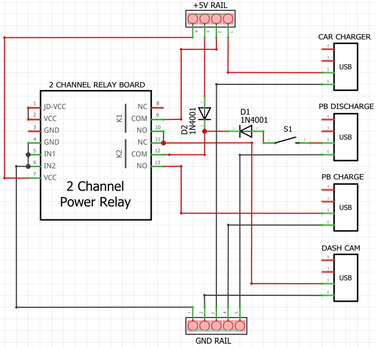
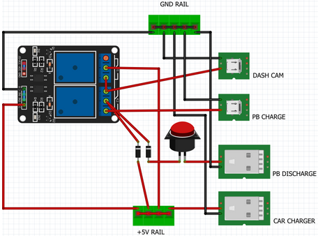

[Up](../)
# Dashcam automatic power bank back up

Dash cameras are great devices that can assist your claim when a road incident happens. Most often incidents that are difficult to attribute to a responsible party are damage sustained to your vehicle while parked. The problem is, dash camera normal power source (the 12V power outlets) stops delivering power when the engine is turned off to avoid discharging the vehicle battery completely. The built in dash camera batteries are very low capacity and usually cannot operate for more than 5 minutes after the engine is turned off.

The common solution to this problem is to wire the dash camera directly to the vehicle battery through the fuse box. However, this runs the risk of discharging the car battery completely if the car is parked for a prolonged period while recording. I am aware that some dashcam manufacturers make voltage monitors that cut off power to the dashcam when the vehicle battery voltage drops below a certain threshold. I feel that these devices are quite expensive for the functionality they provide (normally circa $200).

Instead, I wanted to connect the dash camera to a portable battery (power bank) and have the power source switch from the car to the power bank when the engine is turned off and vice versa. Initially, I was hoping that if I put a power bank between the vehicle USB power (5V) output and the dashcam, the power bank would deliver power to the dashcam and charge while the vehicle is running and then keep delivering power to the dashcam when the car is turned off.

As I found out, it quite doesn't work that way. Most power banks cannot charge and deliver power at the same time. Therefore, an external circuit would be required to automatically switch between charging and discharging the power bank as well as switching the power source of the dashcam. Luckily I was able to find an excellent blog post detailing on just how to do this [here](https://diyblog.me/post/uninterruptible-5v-usb-power-supply/). The write up is well presented with a bill of material and easy to understand circuit and wiring diagram. I recommend reading this post as I won't regurgitate what is already documented.

So why am I writing this then? Well, there were couple of small tweaks that I had to make to the [DIY Blog](https://diyblog.me/post/uninterruptible-5v-usb-power-supply/) circuit to make it work in my case. Additionally, I also wanted to add a switch to cut off the power bank power supply when the vehicle is parked in a safe location for a long period. I thought I would share this tweak in case some one else also has a similar issue and also provide a New Zealand specific bill of material with where to buy some of the components.

The specific power bank I used did not seamlessly switch from charging to discharging into the dashcam when the engine turned off. I suspect this was because the power bank controller looks for a new device connection to its output to start delivering power. Therefore, I had to simulate or make the power bank think that I was disconnecting the charging cable and connecting a device for charging. This was easy enough to achieve with two additional diodes.

The modified circuit I used is shown below:

 

A list of components I used and where I sourced them:

Item|Link|Price
----|----|-----
2 channel 2-way 5V relay module | https://www.surplustronics.co.nz/products/7145-relay-2-channel-module-expansion-board-5v-low-level-triggered | $8.50
2x 3 Way WAGO Splice Terminal Block (because I couldn't find 4 or 5 way)| https://www.jaycar.co.nz/3-way-wago-splice-terminal-block/p/HM32352x | $2.20
Grey Jiffy Box - 130 x 68 x 44mm | https://www.jaycar.co.nz/jiffy-box-grey-130-x-68-x-44mm/p/HB6023	| $5.20
2x 1N4001 diodes | |
Jumper wires | |
SPST switch | |
Transcend DrivePro 230 |https://www.pbtech.co.nz/product/CAMTRS0231/Transcend-DrivePro-230-Dash-Cam-with-Buit-in-WiFi	| $159
20,000 mAh power bank | | $60
