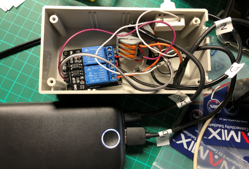

[Up](../)
# Dashcam automatic power bank back up

   

*List of components*

Item | Link | Price
---- | ---- | -----
2 channel 2-way 5V relay module | [link](https://www.surplustronics.co.nz/products/7145-relay-2-channel-module-expansion-board-5v-low-level-triggered) | $8.50
2x 3 Way WAGO Splice Terminal Block (because I couldn't find 4 or 5 way) | [link](https://www.jaycar.co.nz/3-way-wago-splice-terminal-block/p/HM32352x) | $2.20
Grey Jiffy Box - 130 x 68 x 44mm | [link](https://www.jaycar.co.nz/jiffy-box-grey-130-x-68-x-44mm/p/HB6023)	| $5.20
2x 1N4001 diodes | |
Jumper wires | |
SPST switch | |
Transcend DrivePro 230 |[link](https://www.pbtech.co.nz/product/CAMTRS0231/Transcend-DrivePro-230-Dash-Cam-with-Buit-in-WiFi)	| $159
20,000 mAh power bank | | $60

*Final assembly*

