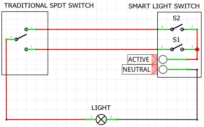

[Up](../)
# Implementing 2-way switching with smart light switches

Most smart switches are simple SPST switches. The traditional two-way light switching circuit requires two SPDT switches.The solution I came up with was to use two of the SPST switches (2 gang) and then emulate SPDT switching using automation scenes. Most smart light switches allow you to program scenes where by you can trigger actions based on switch actions. There are two states for each switch, therefore you need to program 4 states each switch can be based on the logic table below. After that pressing any of the two switches on the smart light switch should toggle the light on or off.

*Light switch circuit*

*Logic table*

Trigger | Action
-------  | ------
S1 ON | S2 OFF
S1 OFF | S2 ON
S2 ON | S1 OFF
S2 OFF | S1 ON
